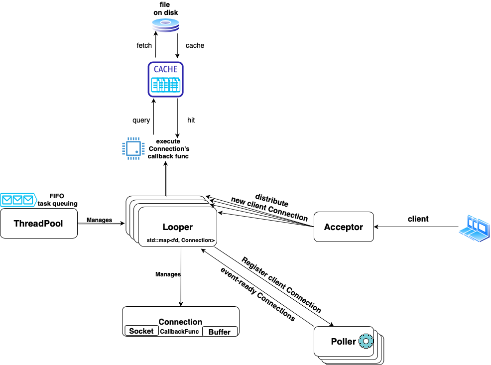

-----------------

[](https://github.com/YukunJ/Turtle/actions/workflows/build_actions.yml)
<a href="https://github.com/YukunJ/Turtle/blob/main/LICENSE"></a>
<a href="https://github.com/YukunJ/Turtle"></a>
<a href="https://github.com/YukunJ/Turtle"></a>
<a href="https://github.com/YukunJ/Turtle"></a>
<a href="https://github.com/YukunJ/Turtle/stargazers"></a>
<a href="https://github.com/YukunJ/Turtle/network/members"></a>
## TURTLE

[**中文文档** Chinese Version](./README_CN.md)

**Turtle** is a C++17-based lightweight network library for web server mainly on Linux. It abstracts the tedious manipulations on the socket into elegant and reusable classes. It allows a fast server side setup where the custom business logic could be specified for each client TCP connection in the form of a callback function. It now supports HTTP GET/HEAD request and response as well.

For any question, feel free to raise issue or pull request or drop me an [email](mailto:yukunj.cs@gmail.com) here.

### Highlight

+ Set non-blocking socket and edge-trigger handling mode to support high concurrency workload.
+ Adopt the 'one reactor per thread' philosophy by [Shuo Chen](https://github.com/chenshuo) with thread pool management.
+ Achieve low coupling and high extensible framework.
+ Allow users to build custom server by only providing 2 callback functions.
+ Support HTTP GET/HEAD request & response.
+ Support dynamic CGI request & response.
+ Support Caching mechanism.
+ Support MySQL Database interaction.
+ Compatible building with MacOS using kqueue.
+ Support asynchronous consumer-producer logging.
+ Unit test coverage by [Catch2](https://github.com/catchorg/Catch2) framework.

### System Diagram



The above system architecture diagram briefly shows how the **Turtle** framework works on a high level.

1. The basic unit is a **Connection** which contains a **Socket** and a **Buffer** for bytes in-and-out. Users register a **callback** function for each connection.
2. The system starts with an **Acceptor**, which contains one acceptor connection. It builds connection for each new client, and distribute the workload to one of the **Looper**s.
3. Each **Poller** is associated with exactly one **Looper**. It does nothing but epoll, and returns a collection of event-ready connections back to the **Looper**.
4. The **Looper** is the main brain of the system. It registers new client connection into the **Poller**, and upon the **Poller** returns back event-ready connections, it fetches their callback functions and execute them.
5. The **ThreadPool** manages how many **Looper**s are there in the system to avoid over-subscription.
6. Optionally there exists a **Cache** layer using LRU policy with tunable storage size parameters.

The **Turtle** core network part is around 1000 lines of code, and the HTTP+CGI module is another 700 lines.

### Docker

If you are not a Linux system but still want to try out the **Turtle** on Linux for fun, we provide a Vagrant File to provision the Linux Docker. Notice as of current, **Turtle** is compatible with Linux and MacOS for build.

1. Install [Vagrant](https://www.vagrantup.com/downloads) and [Docker](https://docs.docker.com/desktop/). For macOS, you may use homebrew to install Vagrant but **do not** use homebrew to install Docker. Instead, download Docker Desktop from the link above.

2. Start the Docker application in the background

3. Drag out the `Vagrantfile` and place it in parallel with the `Turtle` project folder. For example, consider the following file structure:

```text
/Turtle_Wrapper
    - /Turtle
    - /Vagrantfile
```

4. `cd` to the `Turtle_Wrapper` folder and run command `vagrant up --provider=docker`. This step should take a few minutes to build up the environment and install all the necessary tool chains.

5. Enter the docker environment by `vagrant ssh developer`

6. `cd` to the directory `/vagrant/Turtle`. This directory is in sync with the original `./Turtle`folder. You may modify the source code and its effect will be propagated to the docker's folder as well.

7. Follow the steps in next section to build up the project.

### Build

You may build the project using **CMake**.

Once you are at the root directory of this project, execute the followings:

```console
// Setup environment (Linux)
$ sh setup/setup.sh
$ sudo systemctl start mysql 
$ sudo mysql < setup/setup.sql  // setup the default mysql role for testing

// Build
$ mkdir build
$ cd build
$ cmake .. // You may add -DLOG_LEVEL=NOLOG to disable logging
$ make

// Format & Style Check & Line Count
$ make format
$ make cpplint
$ make linecount
```

### Performance Benchmark

To test the performance of **Turtle** server under high concurrency, we adopt [Webbench](http://cs.uccs.edu/~cs526/webbench/webbench.htm) as the stress testing tool.

The source code of the Webbench is stored under the `./webbench` directory along with a simple testing shell script. 

We fully automated the process so that you can execute the benchmark test in one command:
```console
$ make benchmark

# in Linux the above command will
# 1. build the webbench tool
# 2. run the http server in the background at default 20080 port, serving the dummy index file
# 3. launch the webbench testing with 10500 concurrent clients for 5 seconds
# 4. report back the result to the console
# 5. harvest the background http server process and exit
```

We performed benchmark testing on an Amazon AWS EC2 instance. The details are as follows:

+ **Hardware**: m5.2xlarge instance on **Ubuntu 20.04 LTS** with **8** vCPUs, **32** GiB memory, **50** GiB root storage volume. (Be careful that vCPU is not real CPU core, by experiment `std::hardware_concurrency() = 2` in this case)
+ **QPS**: **62.3**k (no cache) | **62.8**k (with cache)

The performance improvement from **Cache** might not seem significant. Partly because disk I/O is getting faster nowadays, the cost of loading a small `index.html` might be smaller than the mutual exclusive operations in the **Cache**.

When database connector comes into play, the indispensability of the **Cache** layer will be more obvious.

In order to gain a better sense of comparative performance, we benchmarked a few other leading popular C++ network webserver on the Internet with the best configuration to our knowledge in order to be fair. 

To reiterate, by no means should we judge different libraries only on benchmark testing of limited scope and possible misconfiguration by the unfamiliar like us. It's solely for the purpose for getting the magnitude right.

All the benchmarks statistics listed below are performed on the **same hardware** and transferring same dummy index file with **10500** concurrent clients using webbench tool.

1. [TinyWebServer](https://github.com/qinguoyi/TinyWebServer.git): best QPS = **38.5**k

```console
# we run the TinyWebServer with the configuration of:
# 1. listener fd and connection fd mode: -m 1 LT + ET | -m 3 ET + ET
# 2. 8 threads as on a 8 vCPUs instance
# 3. turn off logging
# 4. -a 0 Proactor | -a 1 Reactor
# 5. compiler optimization level set to -O3

# Proactor LT + ET
$ ./server -m 1 -t 8 -c 1 -a 0
$ QPS is 38.5k

# Proactor ET + ET
$ ./server -m 3 -t 8 -c 1 -a 0
$ QPS is 38.2k

# Reactor LT + ET
$ ./server -m 1 -t 8 -c 1 -a 1
$ QPS is 26.7k

# Reactor ET + ET
$ ./server -m 3 -t 8 -c 1 -a 1
$ QPS is 25.6k
```

2. [Muduo](https://github.com/chenshuo/muduo): best QPS = **48.3**k

```console
# We use the 'muduo/net/http/tests/HttpServer_test.cc' as the test program
# set it to run in the benchmark mode with 8 threads in the pool
# with most of the logging disabled
```

3. [libevent](https://github.com/libevent/libevent): single-thread best QPS = **29.0**k

We use the sample script [here](https://github.com/denischatelain/libevent-http-server-get-example) for easy testing.

```console
# Notice this testing is running libevent http server with single-thread using I/O multiplexing
# it's already very performant and has not fully utilized the underlying 8-core hardware.
# we might try test it with pthread and work queue under the multi-thread setting
# but it's too much work for now for the benchmark purpose
```


### API Style
The classes in the **Turtle** library are designed with the focus of decoupling firmly in mind. Most of the components can be taken out alone or a few together and used independently, especially those components in the **network core** module.

Let's take an example from the most basic **Socket** class, assuming that we just want to borrow the **Turtle** library to avoid the cumbersome steps of **socket** establishment. First, let's take a look at the main interface of the **Socket** class:

```CPP
/**
 * This Socket class abstracts the operations on a socket file descriptor
 * It can be used to build client or server
 * and is compatible with both Ipv4 and Ipv6
 * */
class Socket {
 public:
  Socket() noexcept;
  auto GetFd() const noexcept -> int;

  /* client: one step, directly connect */
  void Connect(NetAddress &server_address);

  /* server: three steps, bind + listen + accept */
  void Bind(NetAddress &server_address, bool set_reusable = true);

  /* enter listen mode */
  void Listen();

  /* accept a new client connection request and record its address info */
  auto Accept(NetAddress &client_address) -> int;

 private:
  int fd_{-1}; 
};
```

With such an interface, we can quickly and easily build client and server sockets in a few lines:

```CPP
#include "core/net_address.h"
#include "core/socket.h"

// local Ipv4 address at 8080 port
NetAddress local_address("127.0.0.1", 8080, Protocol::Ipv4);

// build a client
Socket client_sock;
client_sock.Connect(local_address);

// build a server
Socket server_sock;
server_sock.Bind(local_address);
server_sock.Listen();

// accept 1 new client connection request
// client_address will be filled with new client's ip info
NetAddress client_address;
int client_fd = server_sock.Accept(client_address);
```

There are many other components in **Turtle** that are easy to decouple and use separately. You can view the source code and use them according to needs.

### Usage

#### General 

To setup a general custom server, user should create an instance of **TurtleServer** and then only needs to provide two callback functions:
1. **OnAccept(Connection \*)**: A function to do extra business logic when accepting a new client connection.
2. **OnHandle(Connection \*)**: A function to serve an existing client's request.

Notice that most of common functionality for accepting a new client connection is already implemented and supported in the [**Acceptor::BaseAcceptCallback**](./src/include/acceptor.h), including socket accept, setup and put it under monitor of the **Poller**.

The function provided in **OnAccept(Connection \*)** by users will be augmented into the base version and called as well. There is no base version for the **OnHandle(Connection \*)**. Users must specify one before they can call **Begin()** on the server.

Let's walk through an example of traditional echo server in less than 20 lines:

```CPP
#include "core/turtle_server.h"

int main() {
  TURTLE_SERVER::NetAddress local_address("0.0.0.0", 20080);
  TURTLE_SERVER::TurtleServer echo_server(local_address);
  echo_server
      .OnHandle([&](TURTLE_SERVER::Connection* client_conn) {
        int from_fd = client_conn->GetFd();
        auto [read, exit] = client_conn->Recv();
        if (exit) {
          client_conn->GetLooper()->DeleteConnection(from_fd);
          // client_conn ptr is invalid below here, do not touch it again
          return;
        }
        if (read) {
          client_conn->WriteToWriteBuffer(client_conn->ReadAsString());
          client_conn->Send();
          client_conn->ClearReadBuffer();
        }
      })
      .Begin();
  return 0;
}
```
The demo of this echo [server](./demo/echo_server.cpp) and [client](./demo/echo_client.cpp) is provided under the `./demo` folder for your reference. In the `build` directory, you can execute the following and try it out.

```console
$ make echo_server
$ make echo_client

// in one terminal
$ ./echo_server

// in another terminal
$ ./echo_client
```

#### HTTP

The HTTP server [demo](./src/http/http_server.cpp) is under `./src/http` folder for reference as well. It supports **GET** and **HEAD** methods. A simple HTTP server could be set up in less than 50 lines with the help of **Turtle** core and http module. 

#### CGI
The CGI module is built upon HTTP server and executes in the traditional parent-child cross-process way. After parsing the arguments, the [**Cgier**](./src/include/http/cgier.h) `fork` a child process to execute the cgi program and communicate back the result to parent process through a shared temporary file. 

It assumes the cgi program resides under a `/cgi-bin` folder and arguments are separated by `&`. For example, if there is a remote CGI program `int add(int a, int b)` that adds up two integers. To compute `1+2=3`, The HTTP request line should be

```console
GET /cgi-bin/add&1&2 HTTP/1.1
```

#### Database
Since database is an indispensable part of many web applications, **Turtle** also supports basic interactions with databases, **MySQL** in specific. We wrap the official MySQL C++ Connector into simple connections that can execute queries and return back results. Users of **Turtle** may consider plug in this component when implementing custom service callback functions.

The relevant source code is under [db](./src/db) folder. Users may refer to [setup.sql](./setup/setup.sql) and [mysqler_test](./test/db/mysqler_test.cpp) for setup and simple usage reference.

For a bare minimal use example, suppose on port `3306` of `localhost` the `root` user with password `root` in the database `test_db` has a table `user` of two fields `firstname` and `lastname`. We could update and query as follows:

```CPP
#include <string>
#include "db/mysqler.h"

/* for convenience reason */
using TURTLE_SERVER::DB::MySqler;

int main(int argc, char* argv[]) {
    // init a db connection
    MySqler mysqler = MySqler("127.0.0.1", 3306, "root", "root", "test_db");
    // insert a new user Barack Obama, synchronously
    std::string command_insert = "INSERT INTO user (firstname, lastname) VALUES ('Barack', 'Obama');";
    mysqler.ExecuteBlocking(command_insert);
    // query for whose firstname is Barack, asynchronously via std::async
    std::string command_query = "SELECT firstname, lastname FROM user WHERE firstname = 'Barack';"
    auto fut = mysqler.ExecuteQueryNonBlocking(command_query);      
    sql::ResultSet result_set = fut.get();  // execute
    // maybe many people has firstname Barack, iterator
    size_t return_size = result_set->rowsCount();
    while (result_set->next()) {
        // the corresponding lastname for this user
        std::string lastname = result_set->getString("lastname");
    }
    return 0;
}
```

#### Logging
Logging is supported in an asynchronous consumer-producer fashion with Singleton pattern. Callers non-blockingly produce logs, and a background worker thread periodically takes care of all the logs produced since its last wakeup in a FIFO fashion. The exact way to "take care" of the logs is up to customization by strategy plugin. The default is to write to a log file on disk. And you may also tune refresh interval length or refresh log count.

Four levels of logging is available in terms of macros:

+ `LOG_INFO`
+ `LOG_WARNING`
+ `LOG_ERROR`
+ `LOG_FATAL`

You may disable any logging by passing the flag `-DLOG_LEVEL=NOLOG` in CMake build.

### Future Work
This repo is under active development and maintainence. New features and fixes are updated periodically as time and skill permit.

The followings are on the **TODO** list:

- ✅ Support serving HTTP GET/HEAD Request & Response
- ✅ Revise according to this [code review](https://codereview.stackexchange.com/questions/282220/tiny-network-web-framework-library-in-c) suggestions
- ✅ Refactor the architecture into multiple Reactor mode to improve concurrency
- ✅ Add performance testing benchmark
- ✅ Add a Cache layer to reduce server load and increase responsiveness
- ✅ Enable dynamic CGI request support
- ✅ Support MacOS build compatability by kqueue
- ✅ Complete unit testing coverage
- ✅ Benchmark with other leading libraries
- [ ] Profile Turtle's main runtime bottleneck
- [ ] Review suggestions on [reddit](https://www.reddit.com/r/cpp/comments/10vrv4i/seeking_improve_advice_on_my_c_network_library/) are listed on issues to contemplate and experiment
- ✅ Support asynchronous logging mechanism
- [ ] Support timing each client connection and kills inactive ones
- ✅ Support Database connection

We also welcome new feature request. We will review them one by one, and priortize its implementation if applicable. Or direct pull request is also welcomed.

### Reference

Serveral reference books and projects are consulted during the development of **Turtle**. Much appreciation to those excellent references and helps received.

+ [Network Programming Using Internet Sockets](https://beej.us/guide/bgnet/)
+ [Linux Multithreaded Server Programming: Using the Muduo C++ Network Library](http://www.amazon.cn/dp/B00FF1XYJI)
+ [Muduo](https://github.com/chenshuo/muduo)
+ [TinyWebServer](https://github.com/qinguoyi/TinyWebServer)
+ [30dayMakeCppServer](https://github.com/yuesong-feng/30dayMakeCppServer)
+ [Very basic C++ HTTP Parser](https://codereview.stackexchange.com/questions/205704/very-basic-c-http-parser)
+ [C++ Threaded Logger](https://codereview.stackexchange.com/questions/191880/c-threaded-logger)
+ [MySQL C++ official Documentation](https://dev.mysql.com/doc/connector-cpp/1.1/en/connector-cpp-examples-complete-example-1.html)