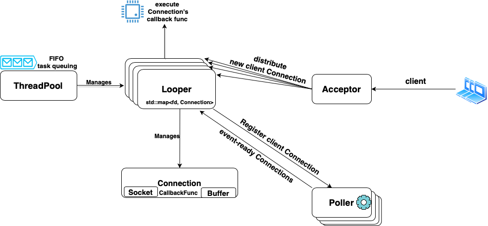

-----------------
## TURTLE

**Turtle** is a C++17-based lightweight network framework for web server. It abstracts the tedious manipulations on the Unix socket into elegant and reusable classes. It allows a fast server side setup where the custom business logic could be specified for each client TCP connection in the form of a callback function. 

For any question, feel free to raise issue or pull request or drop me an [email](mailto:yukunj@andrew.cmu.edu) here.

### Highlight

+ Adopt non-blocking socket and edge-trigger handling mode to support high concurrency workload.
+ Apply thread pool management to asynchronously execute requests and avoids high-of-line blocking to a great extent.
+ Achieve low coupling and high extensible framework
+ Allow users to build custom server by only implementing 2 virtual callback functions.

### System Diagram



The above system architecture diagram briefly shows how the **Turtle** framework works on a high level.

1. The basic unit is a **Connection** which contains a **Socket** and a **Buffer** for bytes in-and-out. Users register a **callback** function for each connection.
2. The system starts with an **Acceptor**, which contains one acceptor connection which is under monitor of the **Poller**. It builds connection for each new client.
3. The **Poller** does nothing but epoll, and returns a collection of event-ready connections back to the **Looper**.
4. The **Looper** is the main brain of the system. It registers new client connection into the **Poller**, and upon the **Poller** returns back event-ready connections, it fetches their callback functions and submit those to the **ThreadPool**.
5. The **ThreadPool** is the executor. It has an FIFO task queuing to execute the callback functions submitted by the **Looper**.

### Docker

If you are not a Linux system but still want to try out the Turtle for fun, we provide a Vagrant File to provision the Linux Docker.

1. Install [Vagrant](https://www.vagrantup.com/downloads) and [Docker](https://docs.docker.com/desktop/). For macOS, you may use homebrew to install Vagrant but **do not** use homebrew to install Docker. Instead, download Docker Desktop from the link above.

2. Start the Docker application in the background

3. Drag out the `Vagrantfile` and place it in parallel with the `Turtle` project folder. For example, consider the following file structure:

```text
/Turtle_Wrapper
    - /Turtle
    - /Vagrantfile
```

4. `cd` to the `Turtle_Wrapper` folder and run command `vagrant up --provider=docker`. This step should take a few minutes to build up the environment and install all the necessary tool chains.

5. Enter the docker environment by `vagrant ssh developer`

6. `cd` to the directory `/vagrant/Turtle`. This directory is in sync with the original `./Turtle`folder. You may modify the source code and its effect will be propagated to the docker's folder as well.

7. Follow the steps in next section to build up the project.

### Build

You may build the project using **CMake**.

Once you are at the root directory of this project, execute the followings:

```console
// Build
$ mkdir build
$ cd build
$ cmake .. // because CMakeList.txt is in the root directory
$ make

// Format & Style Check
$ make format
# make cpplint
```

### Usage

To setup a custom server, it should inherit from the base class [**TurtleServer**](./src/include/turtle_server.h) and only needs to specify two callback virtual functions:
1. **OnAccept(Connection \*)**: A function to do extra business logic when accepting a new client connection.
2. **OnHandle(Connection \*)**: A function to serve an existing client's request.

Notice that most of common functionality for accepting a new client connection is already implemented and supported in the [**Acceptor::BaseAcceptCallback**](./src/include/acceptor.h), including socket accept, setup and put it under monitor of the **Poller**.

The virtual function **OnAccept(Connection \*)** users implement will be augmented into the base version and called as well. There is no base version for the **OnHandle(Connection \*)**.

Let's walk through an example of traditional echo server in less than 30 lines:

```CPP
/* inherit from TurtleServer */
class EchoServer : public TurtleServer {
 public:
  explicit EchoServer(NetAddress server_address)
      : TurtleServer(server_address) {}
      
  /* nothing to add to base */
  void OnAccept(Connection *server_conn) final {}
  
  /* echo back what's received from client */
  void OnHandle(Connection *client_conn) final {
    int from_fd = client_conn->GetFd();
    auto [read, exit] = client_conn->Recv();
    if (exit) {
      client_conn->GetLooper()->DeleteConnection(from_fd);
      return; /* client_conn is no longer valid */
    }
    if (read) {
      client_conn->WriteToWriteBuffer(client_conn->ReadAsString());
      client_conn->Send(); // write buffer is automatically cleared after send
      client_conn->ClearReadBuffer();
    }
  }
};
```
The demo of this echo server and client is provided under the `./demo` folder for your reference. In the `build` directory, you can execute the following and try it out.

```console
$ make echo_server
$ make echo_client

// in one terminal
$ ./echo_server

// in another terminal
$ ./echo_client
```

### Future Work
This repo is under active development and maintainence. New features and fixes are updated periodically as time and skill permit.

The followings are on the **TODO** list:

- [ ] Supports serving HTTP Request
- [ ] Add performance testing benchmark
- [ ] Complete unit testing coverage
- [ ] Supports timing each client connection and kills inactive ones

### Reference

Serveral reference books and projects are consulted during the development of **Turtle**. Much appreciation to those excellent references and helps received.

+ [Network Programming Using Internet Sockets](https://beej.us/guide/bgnet/)
+ [Linux Multithreaded Server Programming: Using the Muduo C++ Network Library](http://www.amazon.cn/dp/B00FF1XYJI)
+ [Muduo](https://github.com/chenshuo/muduo)
+ [TinyWebServer](https://github.com/qinguoyi/TinyWebServer)
+ [30dayMakeCppServer](https://github.com/yuesong-feng/30dayMakeCppServer)
