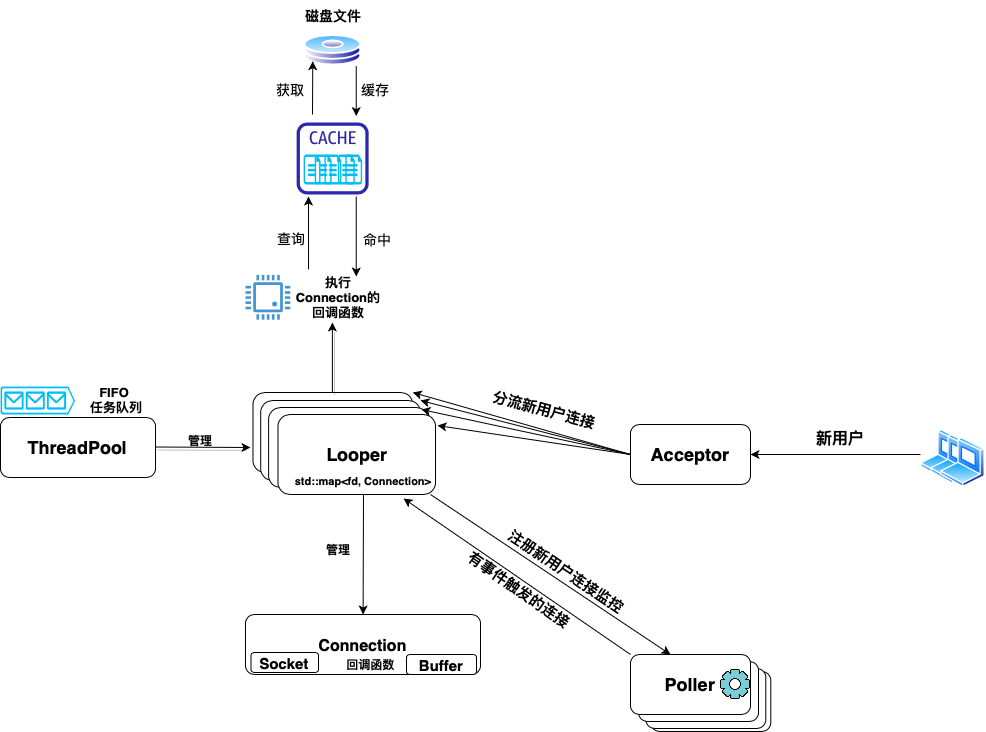

-----------------
## TURTLE

[**English Version** 英文文档](./README.md)

**Turtle**是一个基于C++17的Linux轻量级网络库. 它将繁琐的套接字操作抽象为优雅可复用的类. 它支持自定义服务器的快速设立: 以回调函数的形式为每一个用户的TCP连接加入业务逻辑. 它同时支持HTTP协议的GET/HEAD请求与回复.

如果有任何问题, 欢迎提出issue, 提交pull request或者给我们发一封[邮件](mailto:yukunj@andrew.cmu.edu).

### 亮点概述

+ 采用非阻塞套接字和边缘触发(ET)的事件处理模式来容纳高并发.
+ 采纳[陈硕](https://github.com/chenshuo)先生的'one reactor per thread'的设计思路, 并以线程池进行管理.
+ 低耦合和可单独扩展使用的库设计.
+ 支持HTTP协议的GET/HEAD请求与回复.
+ 支持可调参的缓存层来加快响应与减低服务器负载


### 系统架构



上图是**Turtle**系统架构的一个简单概括性图示.

1. 最基本的单位是一条**Connection**, 它内含了一个**Socket**和一个**Buffer**来分别处理套接字文件描述符与字节级数据的进与出. 用户可以为每一条**Connection**注册回调函数.
2. 系统由一个**Acceptor**开始, 它本质上是一个专门处理接受新用户连接请求的**Connection**. 它为每个用户建立**Connection**连接, 然后将其随机分流给某一个**Looper**去负责.
3. 每个**Looper**都拥有一个**Poller**. **Poller**只负责在它所监听的那些连接上做epoll, 然后将有事件触发的连接反馈给**Looper**.
4. **Looper**是该系统的核心组件, 每个都单独运行在一个线程中. 它从**Poller**中接收到有事件触发的用户连接后, 会获取并执行它们的回调函数.
5. **ThreadPool**线程池管理着系统中有多少个**Looper**在运行来防止注册过多线程使得性能下降.
6. 额外的, 可调参数的**Cache**组件以LRU的策略来缓存最近访问的资源.

**Turtle**核心库部分约**1000**行代码, HTTP模块约**500**行代码.

### Docker

如果您不在Linux系统上, 但仍希望能尝试**Turtle**库, 我们提供Vagrant文件来部署一个Linux Docker.

1. 安装 [**Vagrant**](https://www.vagrantup.com/downloads)和[**Docker**](https://docs.docker.com/desktop/). 对MacOS用户, 您可以使用homebrew来安装Vagrant, 不过请不要使用homebrew来安装Docker. 请使用上面的链接下载Mac Docker桌面版.

2. 开启运行Docker程序.

3. 把`Vagrantfile`拖出来并和本`Turtle`项目文件夹并行摆放. 例如, 参考如下的文件结构:

```text
/Turtle_Wrapper
    - /Turtle
    - /Vagrantfile
```

4. `cd`到`Turtle_Wrapper`文件夹中并运行指令`vagrant up --provider=docker`. 这一步会花费几分钟的时间去部署环境和安装Build所需要的依赖包.

5. 通过执行`vagrant ssh developer`进入到Docker环境中.

6. `cd`到`/vagrant/Turtle`文件夹. 这个文件夹是和原文件夹`./Turtle`自动同步的. 你可以在原文件中修改代码, 而改动会被自动同步到docker里的文件夹.

7. 按照下个章节的步骤构建项目.

### 构建

您可以使用**CMake**构建本项目.

当您在项目的根路径时, 可以执行以下指令:

```console
// Build
$ mkdir build
$ cd build
$ cmake ..
$ make

// 格式化 & 风格检验 & 代码行数统计
$ make format
$ make cpplint
$ make linecount
```

### 性能测试

为了测试**Turtle**服务器在高并发情况下的性能, 我们采用[Webbench](http://cs.uccs.edu/~cs526/webbench/webbench.htm)作为压测的工具.

性能测试的过程是全自动化的. 您可以执行以下指令来一键压测:

```console
$ make benchmark

# 以上指令将会
# 1. 构建Webbench压测工具
# 2. 在背景模式中运行http服务器, 默认监听20080端口来传递一个大约1MB大小的index文件
# 3. 使用Webbench压测工具来创建10500个并发用户请求, 运行5秒时间
# 4. 将性能统计数据汇报到终端
# 5. 关闭背景模式运行中的http服务器并退出
```

我们在Amazon EC2云服务器上进行了性能测试. 具体如下:

+ **硬件配置**: **m5.2xlarge**云服务器, 使用**Ubuntu 20.04 LTS**操作系统, 拥有**8**vCPUs, **32**GiB内存, **50**GiB根硬盘存储.
+ **QPS**: **49.7**k (无缓存) | **50.4**k (激活缓存)

**Cache**缓存层所带来的性能提升或许不是很明显. 部分由于磁盘I/O现在也变得更快了, 从磁盘中加载一个1MB大小的index文件的代价或许小于在**Cache**上的互斥操作.

我们相信在之后, 当数据库连接功能被支持并引入后, **Cache**缓存层的必要性会更加明显.

### 用例展示

为设立一个自定义化的服务器, 用户需要构建一个**TurtleServer**的实例, 然后只需要提供2个回调函数:
1. **OnAccept(Connection \*)**: 在接收新用户连接请求时执行额外的业务逻辑.
2. **OnHandle(Connetion \*)**: 在用户发来请求时的业务逻辑.

请注意大部分的接收新用户的基本功能已经在基本版本[**Acceptor::BaseAcceptCallback**](./src/include/acceptor.h)中实现了, 包括套接字建立, 设立**Connection**并放入**Poller**的监控.

用户所提供的**OnAccept(Connection \*)**函数将会被合并到基本版本中一起执行. 对于另一个函数**OnHandle(Connection \*)**, 并没有基础版本的存在. 用户必须提供给服务器一个版本.

下面让我们一起来看看如何在20行内搭建一个简单的传统echo服务器:

```CPP
#include "turtle_server.h"

int main() {
  TURTLE_SERVER::NetAddress local_address("0.0.0.0", 20080);
  TURTLE_SERVER::TurtleServer echo_server(local_address);
  echo_server
      .OnHandle([&](TURTLE_SERVER::Connection* client_conn) {
        int from_fd = client_conn->GetFd();
        auto [read, exit] = client_conn->Recv();
        if (exit) {
          client_conn->GetLooper()->DeleteConnection(from_fd);
          // client_conn 指针在这之后即失效了, 不再触碰
          return;
        }
        if (read) {
	  // 将读buffer复制到写buffer
          client_conn->WriteToWriteBuffer(client_conn->ReadAsString());
	  // 原封不动echo回去
          client_conn->Send();
          client_conn->ClearReadBuffer();
        }
      })
      .Begin();
  return 0;
}
```

这个echo[服务端](./demo/echo_server.cpp)和[用户端](./demo/echo_client.cpp)的demo在`./demo`文件夹中供您参考. 在`build`文件夹路径中, 可以执行以下指令来运行它:

```console
$ make echo_server
$ make echo_client

// 在一个终端窗口
$ ./echo_server

// 在另一个终端窗口
$ ./echo_client
```

HTTP协议服务端的[demo](./src/http/http_server.cpp)在`./src/http`文件夹中供参考. 一个简单的HTTP协议服务器可以在**Turtle**核心库和HTTP模块扩展库的帮助下在50行内被搭建起来.


### 未来计划

本项目正处于积极的维护和更新中. 新的修正和功能时常会被更新, 在我们时间和技术允许的条件下.

下列是一些**TODO**列表:

- ✅ 支持HTTP协议的GET/HEAD请求与回复
- ✅ 根据[code review](https://codereview.stackexchange.com/questions/282220/tiny-network-web-framework-library-in-c)的建议润色代码
- ✅ 将结构重构为多Reactor模式来增强并发性能
- ✅ 加入性能测试的benchmark
- ✅ 加入缓存层来减轻服务器负载并加快响应
- [ ] 完成单元测试的覆盖
- [ ] 支持定时器功能来删除不活跃的用户连接
- [ ] 支持数据库连接功能

也欢迎大家提出新的功能需求, 我们会逐一考虑, 如果可行的话将会优先实现. 或者直接提pull request.

### 参考文献

在开发构建本项目的过程中, 收到了许多帮助也参考了不少优秀的参考资料和他人典范作品.

+ [Network Programming Using Internet Sockets](https://beej.us/guide/bgnet/)
+ [Linux多线程服务端编程：使用muduo C++网络库](http://www.amazon.cn/dp/B00FF1XYJI)
+ [Muduo库](https://github.com/chenshuo/muduo)
+ [TinyWebServer](https://github.com/qinguoyi/TinyWebServer)
+ [30天搭建cpp服务器](https://github.com/yuesong-feng/30dayMakeCppServer)
+ [Very basic C++ HTTP Parser](https://codereview.stackexchange.com/questions/205704/very-basic-c-http-parser)
